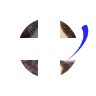

<h1></h1>

У каждого крутого Кота должен быть свой сайт - https://ovvladimir.github.io/cat/

$${\color{white}Skills: \color{green}VUE 3 / \color{blue}Bootstrap 5 / \color{lightblue}JS / \color{orange}HTML / \color{lightgreen}CSS / \color{#ff4136;}PyScript / \color{red}Brython}$$
<h1 align="center"></h1>